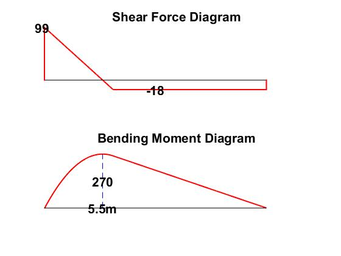

# `fd11.*`


```
% (C) itsN1X@14BME0133.github.io 8045#Q
% This Matlab code can be used for simply supported beam with single point
% load or uniformly distributed to find the
% * Support reaction
% * Maximum Bending Moment
% * Shear force diagram
% * Bending Moment daigramSimply Supported Beam
```

## Outrun

```
 
Length of beam in meter = 21
 
Type 1 for point load, Type 2 for udl
Load case = 2
 
Uniformly distributed load in kN/m = 18
 
Length of udl in meter = 7
 
C.G of udl from left end of the beam in meter = 3
 
Left support Reaction = 108 kN
 
Left support Reaction = 18 kN
 
Maximum bending moment = 270 kNm
>> 

```

### Desantis

A cummulative pointer to SF x BM



### Reference:

Download the [`fd11.m`](fd11.m) to your device.

```

% (C) itsN1X@14BME0133.github.io 8045#Q
% This Matlab code can be used for simply supported beam with single point
% load or uniformly distributed to find the
% * Support reaction
% * Maximum Bending Moment
% * Shear force diagram
% * Bending Moment daigram
clc; clear; close all
disp('Simply Supported Beam');
% Data input section
disp(' ');
L = input('Length of beam in meter = ');
disp(' ');disp('Type 1 for point load, Type 2 for udl')
Type = input('Load case = ');
if Type == 1
disp(' ');
W = input('Load applied in kN = ');
disp(' ');
a = input('Location of Load from left end of the beam in meter = ');
c = L-a;
R1 = W*(L-a)/L; % Left Support Reaction.
R2 = W*a/L; % Right Support Reaction.
else
disp(' ');
W = input('Uniformly distributed load in kN/m = ');
disp(' ');
b = input('Length of udl in meter = ');
disp(' ');
cg = input('C.G of udl from left end of the beam in meter = ');
a = (cg-b/2);
c = L-a-b;
R1 = W*b*(b+2*c)/(2*L); % Left Support Reaction.
R2 = W*b*(b+2*a)/(2*L); % Right Support Reaction.
end
% Discretization of x axis.
n = 1000; % Number of discretization of x axis.
delta_x = L/n; % Increment for discretization of x axis.
x = (0:delta_x:L)'; % Generate column array for x-axis.
V = zeros(size(x, 1), 1); % Shear force function of x.
M = zeros(size(x, 1), 1); % Bending moment function of x.
% Data processing section
if Type == 1
for ii = 1:n+1
% First portion of the beam, 0 < x < b
V(ii) = R1;
M(ii) = R1*x(ii);
% Second portion of the beam, b < x < L
if x(ii) >= a
V(ii) = R1-W;
M(ii) = R1*x(ii)-W*(x(ii)-a);
end
end
x1 = a;
Mmax = W*a*(L-a)/L;
else
for ii = 1:n+1
% First portion of the beam, 0 < x < a
if x(ii) < a
V(ii) = R1;
M(ii) = R1*x(ii);
elseif a <= x(ii) && x(ii)< a+b
% Second portion of the beam, a < x < a+b
V(ii) = R1-W*(x(ii)-a);
M(ii) = R1*x(ii)-W*((x(ii)-a)^2)/2;
elseif x(ii) >= (a+b)
% Second portion of the beam, a+b < x < L
V(ii) = -R2;
M(ii) = R2*(L-x(ii));
end
end
x1 = a+b*(b+2*c)/(2*L);
Mmax = W*b*(b+2*c)*(4*a*L+2*b*c+b^2)/(8*L^2);
end
disp(' ');disp (['Left support Reaction' ' = ' num2str(R1) ' ' 'kN'])
disp(' ');disp (['Left support Reaction' ' = ' num2str(R2) ' ' 'kN'])
disp(' ');disp (['Maximum bending moment' ' = ' num2str(Mmax) ' ' 'kNm'])
figure
subplot(2,1,1);
plot(x, V, 'r','linewidth',1.5); % Grafica de las fuerzas cortantes.
grid
line([x(1) x(end)],[0 0],'Color','k');
line([0 0],[0 V(1)],'Color','r','linewidth',1.5);
line([x(end) x(end)],[0 V(end)],'Color','r','linewidth',1.5);
title('Shear Force Diagram','fontsize',16)
text(a/2,V(1),num2str(V(1)),'HorizontalAlignment','center','FontWeight','bold','fontsize',16)
text((L/2),V(end),num2str(V(end)),'HorizontalAlignment','center','FontWeight','bold','fontsize',16)
axis off
subplot(2,1,2);
plot(x, M, 'r','linewidth',1.5); % Grafica de momentos flectores;
grid
line([x(1) x(end)],[0 0],'Color','k');
line([x1 x1],[0 Mmax],'LineStyle','--','Color','b');
title('Bending Moment Diagram','fontsize',16)
text(x1+1/L,Mmax/2,num2str(roundn(Mmax,-2)),'HorizontalAlignment','center','FontWeight','bold','fontsize',16)
text(x1,0,[num2str(roundn(x1,-2)) 'm'],'HorizontalAlignment','center','FontWeight','bold','fontsize',16)
axis off


```
### Credential

All directions perpetuated.
201810010005


CC4.0
Luser::N1X


[ 1 4 B M E 0 1 3 3 ]

---
## `origin`-master :
# <https://github.com/itsN1X/MEE2002>

xx
